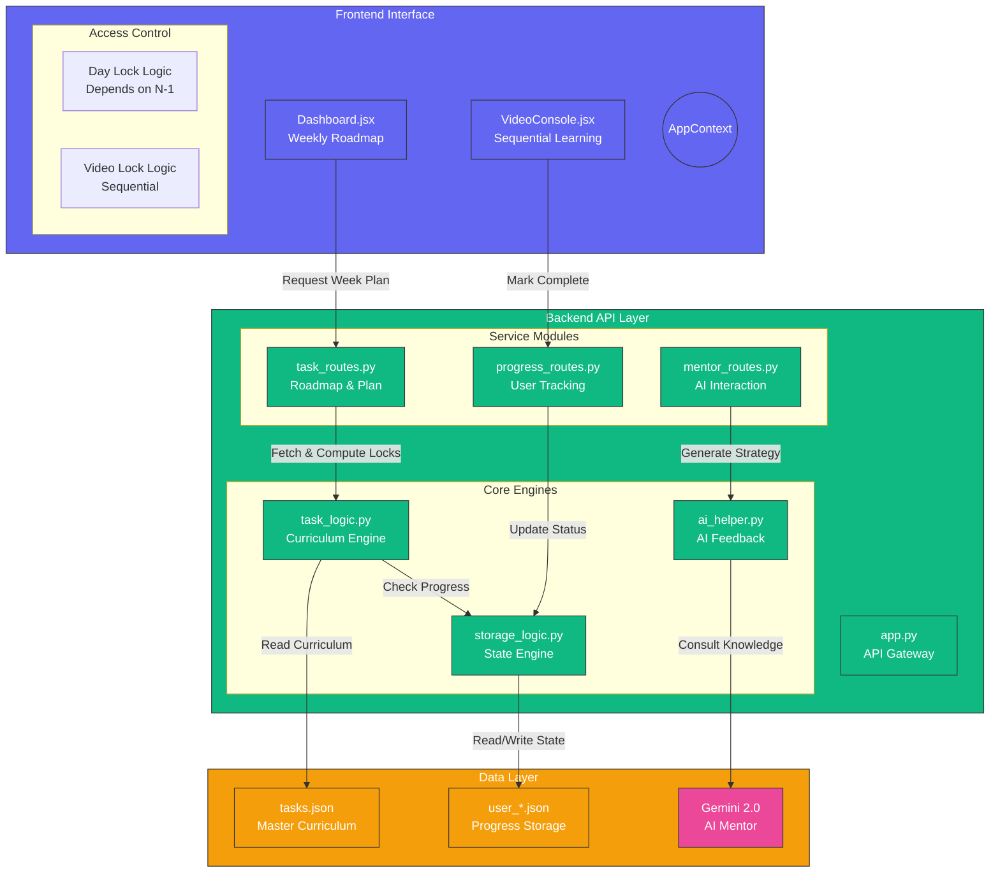

# Project Architecture: KAIRO (AI Career Mentor)

KAIRO is a structured career mentorship platform that combines AI-driven guidance with a rigorous, sequential curriculum system.

## Architectural Overview

## Core Systems

### 1. Hierarchical Locking (Curriculum Guard)
*   **Day Lock**: Unlocking Day $N$ requires all videos and assignments in Day $N-1$ to be complete.
*   **Video Lock**: Within an unlocked day, each video is gated by the completion of the previous one.

### 2. Unified State Management
*   Progress is tracked at the **video level** and **day level** within `user_id.json`.
*   Assignments act as "gates" for day completion.

### 3. Performance Optimization
*   The backend implements a **warmed cache** for `tasks.json` (5000+ lines) to ensure sub-100ms response times for weekly navigation.
