# Project Architecture: KAIRO (AI Career Mentor) — v2.1

KAIRO is a structured career mentorship platform that combines AI-driven guidance with a rigorous, sequential curriculum system.
v2.1 introduces the **Atomic State Engine**, a **Day Completion Engine**, a **Phase Topics Popup**, and a fully resolved **Real-Date Streak System**.

---

## Architectural Overview

```mermaid
graph TD
    %% ── Style Classes ──────────────────────────────────────────────────────
    classDef frontend  fill:#6366F1,stroke:#4338CA,stroke-width:1.5px,color:#fff;
    classDef backend   fill:#10B981,stroke:#059669,stroke-width:1.5px,color:#fff;
    classDef storage   fill:#F59E0B,stroke:#D97706,stroke-width:1.5px,color:#fff;
    classDef ai        fill:#EC4899,stroke:#DB2777,stroke-width:1.5px,color:#fff;
    classDef engine    fill:#8B5CF6,stroke:#7C3AED,stroke-width:1.5px,color:#fff;

    %% ── Frontend Domain ────────────────────────────────────────────────────
    subgraph Frontend ["Frontend  (React + Vite)"]
        direction TB
        Dash["Dashboard.jsx\nWeekly Roadmap + Phase Popup\n(PhaseTopicsModal)"]
        Learn["VideoConsole.jsx\nLearning Cockpit\n[Notes · Quiz · Resources]"]
        Chat["MentorChat.jsx\nConversational UI"]
        Ctx["AppContext.jsx\nupdateCurrentDay() sync"]
    end

    %% ── Backend API Layer ──────────────────────────────────────────────────
    subgraph Backend ["Backend  (Flask, port 5050)"]
        direction TB
        AppPy["app.py\nAPI Gateway / Blueprint Registry"]

        subgraph Routes ["Service Routes"]
            RT_Task["task_routes.py\nCurriculum Delivery\n/get_today_plan · /get_week_plan\n/get_progress · /generate_video_notes"]
            RT_Prog["progress_routes.py\nAtomic Tracking\n/complete_video · /save_submission\n/save_profile · /get_user · /complete_quiz"]
            RT_Ment["mentor_routes.py\nV2 Chat Router\n/ai_mentor · /ai_mentor_chat"]
        end

        subgraph Logic ["Core Engines"]
            LS_Cur["task_logic.py\nProgression Engine\nget_day_data · get_week_data\nis_day_locked · is_day_completed"]
            LS_Store["storage_logic.py ★ REBUILT\nAtomic State DB\nget_user · save_user · update_user\nupdate_streak [Real-Date]\nensure_schema_integrity"]
            LS_DCE["check_day_completion()\nDay Completion Engine ★ NEW\nAll videos done AND assignment\nsubmitted → advance journey.day"]
            LS_AI["ai_helper.py\nEmpathetic Prompt Engine\nMENTOR_SYSTEM_PROMPT\ngenerate_mentor_response"]
            LS_Mentor["mentor_logic.py\nis_query_relevant()"]
        end
    end

    %% ── Data & AI Layer ────────────────────────────────────────────────────
    subgraph Persistence ["Data & AI Layer"]
        KB_Task["tasks.json\nMaster Curriculum\n(139 videos, roadmap[])"]:::storage
        KB_User["storage/users/user_{id}.json\nStrict JSON Schema v2\nprofile · career · journey\nprogress · video_progress\ntask_progress · assignment_progress"]:::storage
        KB_Notes["notes_cache.json\nAI Summary Cache"]:::storage
        LLM["OpenRouter / GPT-4o-mini\nAI Mentor V2"]:::ai
    end

    %% ── Data Flows ──────────────────────────────────────────────────────────

    %% Onboarding
    Dash -- "fetchUserData() → SYSTEM 7" --> RT_Prog
    Dash -- "fetchWeekOverview() → SYSTEM 7" --> RT_Task
    Dash -- "fetchTodayPlan(day)" --> RT_Task

    %% Context sync
    Ctx -. "updateCurrentDay()\nkeeps journeyProgress in sync" .-> Dash

    %% Curriculum delivery
    RT_Task -- "get_day_data / get_week_data" --> LS_Cur
    LS_Cur -- "read roadmap[]" --> KB_Task
    LS_Cur -- "check video/assignment status" --> LS_Store

    %% Video tracking
    Learn -- "POST /api/complete_video" --> RT_Prog
    RT_Prog -- "LOAD → MODIFY video_progress[day_N][vid_id]" --> LS_Store
    RT_Prog -- "update_streak(status=1)" --> LS_Store

    %% Assignment + Day Engine
    Dash -- "POST /api/save_submission" --> RT_Prog
    RT_Prog -- "check_day_completion()" --> LS_DCE
    LS_DCE -- "advance journey.day" --> LS_Store
    RT_Prog -- "update_streak(status=2)" --> LS_Store

    %% Phase popup
    Dash -. "PhaseTopicsModal\n(click calendar icon)" .-> Dash

    %% State persistence
    LS_Store -- "LOAD / SAVE → user_{id}.json" --> KB_User

    %% AI Mentor
    Chat -- "POST /api/ai_mentor_chat\n(user context payload)" --> RT_Ment
    RT_Ment -- "deep context: profile\ncareer, day, streak" --> LS_AI
    LS_AI -- "cached notes ref" --> KB_Notes
    LS_AI -- "API call" --> LLM

    %% Video notes
    Learn -- "POST /api/generate_video_notes" --> RT_Task
    RT_Task -- "generate_video_notes()" --> LS_AI

    %% Style assignments
    class Frontend,Dash,Learn,Chat,Ctx frontend;
    class Backend,AppPy,RT_Task,RT_Prog,RT_Ment backend;
    class LS_Cur,LS_Store,LS_DCE,LS_AI,LS_Mentor engine;
    class Persistence,KB_Task,KB_User,KB_Notes storage;
    class LLM ai;
```



---

## System Inventory (v2.1)

### Frontend Pages

| File | Role | Key Features |
|---|---|---|
| `Dashboard.jsx` | Main learning hub | Weekly roadmap, Phase Topics Popup (modal), SYSTEM 7 dual-refresh after every action, Day Completion banner |
| `VideoConsole.jsx` | Learning cockpit | YouTube embed, AI Notes, Quiz, Resources tabs; **Mark Complete** button (always visible); completion status read from `video_progress[day_N][vid_id]` |
| `MentorChat.jsx` | AI chat | Context-aware mentor Q&A with conversation history |
| `ProfileSetup.jsx` | Onboarding | Career & profile data collection → `POST /api/save_profile` |
| `CareerSelect.jsx` | Career wizard | AI-suggested careers → sets `career.selected` |

### Frontend Components

| File | Role |
|---|---|
| `ProgressionTracker.jsx` | Streak count + 35-day contribution grid (GitHub-style) |
| `PhaseTopicsModal` *(inline in Dashboard)* | Scrollable per-day topic list with ✔ / 🔒 / current status |
| `AppContext.jsx` | Global state; `updateCurrentDay()` syncs `journeyProgress + localStorage` |
| `QuizModal.jsx` | Day quiz overlay |
| `BottomNav.jsx` | Mobile navigation |

### Backend Routes

| Route | Method | Purpose |
|---|---|---|
| `/api/get_today_plan` | POST | Day data (videos, assignment, quiz) |
| `/api/get_week_plan` | POST | Full roadmap with lock/complete status |
| `/api/get_progress/<id>` | GET | Flat progress summary (completed videos, streak) |
| `/api/get_user/<id>` | GET | Full user JSON (new schema) |
| `/api/complete_video` | POST | Mark video done → `video_progress[day_N][vid_id]` → streak+1 |
| `/api/save_submission` | POST | Submit assignment → day completion check → journey.day++ |
| `/api/complete_quiz` | POST | Record quiz score |
| `/api/save_profile` | POST | Onboard / update profile |
| `/api/ai_mentor_chat` | POST | Contextual AI mentor response |
| `/api/generate_video_notes` | POST | AI notes (cached) |

### Backend Logic Engines

| File | Role | v2.1 Changes |
|---|---|---|
| `storage_logic.py` | **Atomic State DB** | ★ Full rewrite: strict schema, `ensure_schema_integrity`, real-date streak engine, clean LOAD-MODIFY-SAVE |
| `task_logic.py` | Progression Engine | `get_day_data`, serial video unlock logic, `is_day_locked` |
| `check_day_completion()` | **Day Completion Engine** | ★ New: gated by all-videos-done AND assignment submitted; returns bool; caller advances `journey.day` |
| `ai_helper.py` | AI Prompt Engine | GPT-4o-mini via OpenRouter; mentor, notes, feedback, career, roadmap generators |
| `mentor_logic.py` | Relevance filter | `is_query_relevant()` before LLM call |

---

## Strict User JSON Schema (v2.1)

```json
{
  "user_id": "string",
  "profile": {
    "name": "", "student_type": "12th",
    "interest": "", "goal": "",
    "financial_background": "", "rank_or_year": ""
  },
  "career": { "selected": "Full Stack Developer", "suggested": [] },
  "journey": { "phase": 1, "day": 1 },
  "progress": {
    "streak": 0,
    "start_date": "YYYY-MM-DD",
    "last_active_date": "",
    "activity": { "YYYY-MM-DD": 0 }
  },
  "video_progress":      { "day_N": { "tXX": true } },
  "task_progress":       {},
  "assignment_progress": { "day_N": { "status": "completed", "proof_link": "", "submitted_at": "" } },
  "updated_at": "ISO timestamp"
}
```

> `activity` values: `0` = no work · `1` = partial (video done) · `2` = full (assignment submitted)

---

## Core Systems Status

| System | Status | Location |
|---|---|---|
| **SYSTEM 1** — Strict JSON Schema | ✅ Complete | `storage_logic.py` → `get_default_user_schema()` |
| **SYSTEM 2** — Real-Date Streak | ✅ Complete | `storage_logic.py` → `update_streak()` |
| **SYSTEM 3** — Video + Quiz Tracking | ✅ Complete | `VideoConsole.jsx` + `/api/complete_video` |
| **SYSTEM 4** — Day Completion Engine | ✅ Complete | `progress_routes.py` → `check_day_completion()` |
| **SYSTEM 5** — Roadmap Phase Popup | ✅ Complete | `Dashboard.jsx` → `PhaseTopicsModal` |
| **SYSTEM 6** — AI Mentor Context | ✅ Active | `mentor_routes.py` + `ai_helper.py` |
| **SYSTEM 7** — Frontend State Sync | ✅ Complete | `Dashboard.jsx` → `fetchUserData()` + `fetchWeekOverview()` |
| **SYSTEM 8** — Dashboard Polish | ✅ Complete | `ProgressionTracker.jsx` streak + contribution grid |
| **SYSTEM 9** — Lock System | ✅ Complete | `task_logic.py` → `is_day_locked()` |

---

## Demo Flow (v2.1)

```
New user → Onboarding → ProfileSetup → CareerSelect
  → Dashboard (Day 1 unlocked, Day 2+ locked)
    → Click video → VideoConsole
      → Watch → click "Mark Complete" → streak+1
      → Return to Dashboard (auto-refresh via fetchUserData)
    → Submit assignment textarea
      → check_day_completion() → journey.day = 2
      → update_streak(status=2)
      → 🎉 Unlock banner → Dashboard updates
    → Double-click any weekly card → PhaseTopicsModal
      → shows topics list with ✔/🔒/current status
    → MentorChat → context-aware AI response
```
